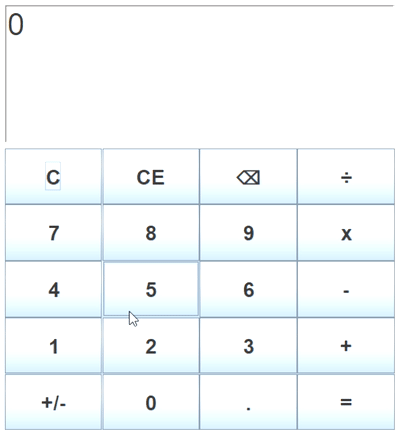

What is it about? 
This project is to built a desktop application of a calculator using Java. It allows users to input numbers and output
results based on some basic arthimetic operations.

What are the basic features? 
It performs basic arthimetic operations (addition, substraction, multiplication, division) on input numbers and
calcuates the results.

What are the additional features? 
It contains a GUI for users input numbers and operands using keyboard not just clicking the buttons. It could also have
higher order operations, such x to the power y.

When will it be completed? 
The project will be completed once the basic features is implemented.

Basic features implemented on 03/01/2022: 
